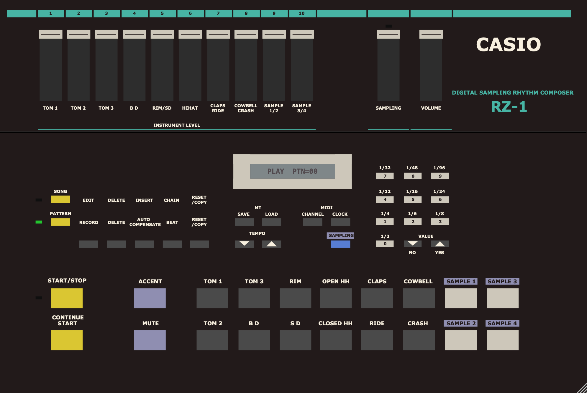

# Casio-RZ-1 (MAME to VST3/AU Instrument)

A software instrument that wraps MAME's **Casio RZ-1** driver (a 1986 sampling
drum machine) as a native arm64 **VST3** and **Audio Unit** plugin using JUCE.
The plugin embeds a headless MAME instance: the RZ-1 panel (800x535 `rz1.lay`)
is rendered into the plugin editor, clicks drive the emulated key matrix, and
the 10 drum voices are summed into the stereo output.

This repo was carved out of the original Ensoniq SD-1 adaptation project; only
what is needed to build the two plugin formats is kept.

## Screenshot



## Status

- VST3 works in Element (panel, buttons, MIDI, LCD refresh, pattern
  record/playback).
- AU works in Logic (the AU defaults to a larger internal MAME buffer to avoid
  Logic's real-time scheduler underruns).
- `auval` from the CommandLineTools fails to enumerate this plugin (and the
  sibling SD-1 AU) with "didn't find the component" even though the system
  AudioComponent registry instantiates it fine - treat Logic as the validator.

## Multi-output routing

Every RZ-1 drum voice has its own stereo output bus in addition to the
Main mix:

| Bus | Content |
|---|---|
| Main Out | Full mix (panel faders + master volume, 1/8 headroom) |
| Tom 1 / Tom 2 / Tom 3 | Individual toms |
| Bass Drum | BD |
| Rim & Snare | Rim shot / snare voice |
| Hi-Hat | Hi-hat voice |
| Claps & Ride | Claps / ride voice |
| Cowbell & Crash | Cowbell / crash voice |
| Sample 1 & 2 | Sample pads 1+2 (shared PCM voice on the real hardware) |
| Sample 3 & 4 | Sample pads 3+4 (shared PCM voice on the real hardware) |

The per-instrument buses carry the dry voice with its panel fader gain applied
(the master volume only affects Main Out), so you can mix the drums on
separate DAW tracks. SAMPLE 1/2 and 3/4 each share one bus because the real
RZ-1 mixes each pair onto a single PCM channel - the emulation can't separate
them any further.

Host notes:

- **Logic**: load **Casio RZ-1** as an AU MIDI-Controlled Effect on a software
  instrument track. The AU exposes all 11 output buses (verified via the
  AudioComponent registry: 11 output elements + 1 input). In the mixer, click
  the "+" button on the channel strip repeatedly to reveal aux channels for
  outputs 3-4, 5-6, ..., 21-22, and route each drum to its own track. The
  sampling input appears as the plugin's Side Chain menu.
- **Element / VST3 hosts**: all 11 buses are active out of the box.

## Panel operations

Keys that need to be held for a combo (SAMPLING, MUTE, ACCENT, DELETE) can be
**latched**: click once to hold, click again to release. This lets you do
two-key combos with a single mouse - click the modifier, click the pad, then
click the modifier again when done (dragging also still works).

### Sampling

1. Click **SAMPLING** to latch it (it stays held).
2. Click **SAMPLE 1-4** to enter sampling standby (LCD shows `SAMPLING n`).
3. Route audio into the plugin: in Logic use the plugin's **Side Chain**
   input; in Element/VST3 enable the **Audio In** bus. The SAMPLING LEVEL
   fader is visual-only (the emulated pot is not wired), so keep the routed
   level healthy.
4. About 1/3 s after the SAMPLE-key click, SAMPLING auto-releases and the
   capture fires - the sampling LED flashes and the LCD shows `SAMPLE OK!`.
   You can also click SAMPLING again to un-latch and capture immediately.
5. Each capture stores 0.2 s. For a 0.4 s linked capture, click **SAMPLE 1
   + 2** or **SAMPLE 3 + 4** in quick succession (or drag over both while
   SAMPLING is held) - the auto-release waits for the last click.

### Muting and accenting

Click **MUTE** (quiet hit) or **ACCENT** (loud hit) to latch it, then click
the instrument/sample pad whose hit you want to affect, then click the
modifier again to release. This works while recording (writes the
muted/accented note into the pattern) and during real-time play. The RZ-1 has
three velocity levels - MUTE ≈ velocity 48, normal ≈ 64/96, ACCENT ≈ 112 -
so MUTE makes a hit quiet but not silent. A fully silent step is a step you
simply don't write a note into (a rest).

### Deleting a note

1. Click **EDIT/RECORD** to enter PATTERN RECORD write standby.
2. Click **VALUE ▲ (YES)** once to enter STEP RECORD.
3. Use **VALUE ▲/▼ (YES/NO)** to move to the step containing the note.
4. Click **DELETE** to latch it, then click the instrument/sample pad whose
   note you want removed from that step. Click DELETE again to release.

Alternative in real time: during REAL TIME RECORD, latch (or hold) DELETE and
hit the pad in time with the note to delete - only that instrument's notes
are removed while DELETE is held.

## MIDI timing

MIDI timing is subject to the emulated device, not just the plugin. The
plugin schedules MIDI delivery accurately (clock and notes are delivered to
the emulated UART within ~1 ms of their target), but the RZ-1's own firmware
adds a variable MIDI→audio response of roughly 2.5–7.5 ms (mean ~4.5 ms,
quantized in ~2 ms steps). That mean is reported as part of the plugin's
latency so the host's delay compensation centers hits on the DAW grid, but
the residual ±2.5 ms spread is the machine's genuine behavior (the same
hardware-era timing a real RZ-1 exhibits).

### Emulated uPD7810 SIO fix ("MIDI DATA ERROR")

An earlier limitation is fixed: under sustained dense MIDI note traffic
(~30–50 notes) the RZ-1 firmware could flash **"MIDI DATA ERROR!"** on the
LCD and drop subsequent notes. Headless reproduction with clean note-ons
only (no clock, no sysex) traced the fault to the emulated **uPD7810 serial
interface** in `mame-mac-master/src/devices/cpu/upd7810/upd7810.cpp`, not to
plugin scheduling (the plugin's MIDI delivery was already verified
byte-perfect).

Root cause: the MAME uPD7810 core's asynchronous receiver sampled each
incoming bit at its **leading edge** - it synchronized on the start-bit
edge and then took one sample per bit at start+1..start+8 bit times. The
real uPD7810 async SIO oversamples (×16/×64 clock rates) and reads bits at
their centers. Depending on the phase between the 31.25 kbaud MIDI stream
and the emulated CPU's sample clock, samples landed on the bit boundaries,
and the emulator's CPU/timer event ordering could read the *previous* bit's
value. That produced sporadic bit errors (e.g. 0x50→0x70, 0x90→0xC9),
framing errors, and finally the firmware's error path (its receive ISR
pushes 0xFF into the ring when the UART error flag is set, and the MIDI
parser's 0xFF branch displays message 38, "MIDI DATA ERROR!").

Fix: the asynchronous receiver now **oversamples the receive line at 4× the
bit rate** and shifts only the samples taken at **bit centers** (start-bit
edge + half a bit, then every bit time) into the receive register. This
matches the real hardware behavior and makes reception insensitive to the
phase between transmitter and receiver. Transmit timing, synchronous mode,
and external-clock mode are unchanged, so other uPD7810-based machines are
not affected. Upstream MAME carries the identical leading-edge sampling
code, so this fix is a candidate for upstreaming there. Verified headlessly:
50 dense note-ons (150 bytes) previously latched the error at note ~11-30
depending on phase; with the fix the same stream decodes 100% clean across
repeated runs, tempos, and harness modes. See `test-scripts/HANDOFF.md` for
the full diagnosis.

## Requirements

- macOS (arm64; the build is hard-set to arm64 in `CMakeLists.txt`)
- CMake 3.22+, a C++20 toolchain
- SDL2 via Homebrew (`brew install sdl2`)
- The RZ-1 ROM set (see below - **not** shipped with this repo)

## Building

```bash
cd Casio-RZ-1
cmake -S . -B build -DJUCE_DIR=work/JUCE -DCMAKE_BUILD_TYPE=Release -DCMAKE_OSX_ARCHITECTURES=arm64
cmake --build build -j8
```

The bundles land in `build/CasioRZ1_artefacts/`:

- `VST3/Casio RZ-1.vst3`
- `AU/Casio RZ-1.component`

The AU bundle gets the MAME `plugins/` resources installed and ad-hoc
codesigned automatically (Logic loads it locally).

To use them, copy the bundles into `~/Library/Audio/Plug-Ins/VST3/` and
`~/Library/Audio/Plug-Ins/Components/` (or the `/Library/...` equivalents),
then rescan/restart the host.

## ROMs (required, not included)

Place the RZ-1 machine ROMs in `~/Documents/CasioRZ1/ROMs/rz1/`:

```text
upd7811g-120.bin   (4 KB  - CPU microcode)
program.bin        (16 KB - main program ROM)
sound_a.cm5        (32 KB - drum waveforms part A)
sound_b.cm6        (32 KB - drum waveforms part B)
hd44780_a00.bin    (4 KB  - HD44780 LCD character-generator device ROM)
```

Missing `hd44780_a00.bin` = black panel (the plugin self-checks and shows a
red error). The 2018-era dump (CRC 01d108e2) boots with a checksum warning;
MAME 2025 expects CRC e459877c. The plugin skips MAME's modal boot-warning
screens (see below), so the mismatch is cosmetic.

## MAME patch

`Mame_Patches/ui.cpp` is the "VST HACKED" `display_startup_screens()` override
(skip all startup dialogs, go straight to in-game mode) and **is already
applied** to `mame-mac-master/src/frontend/mame/ui/ui.cpp` in this tree. Without
it, MAME's "press any key" ROM-audit warning blocks boot because the plugin has
no keyboard input path.

The prebuilt MAME libraries live in
`mame-mac-master/build/osx_clang/bin/x64/Release/` (the plugin links these
directly). The MAME source tree is kept so the libs can be rebuilt; see
`PHASE2-BUILD-ROADMAP.md` for context.

## Notes

- The RZ-1 boots with empty pattern memory (MAME NVRAM starts blank), so
  START/STOP does nothing until you record a pattern: PATTERN -> number ->
  EDIT/RECORD -> START/STOP -> hit pads -> START/STOP -> START/STOP.
- The numpad keys are data-entry keys: they act after PATTERN/SONG/EDIT-RECORD,
  not standalone.
- Plugin "Internal Buffer" default: 2048 samples for the AU (Logic stability),
  512 for VST3.
- See `TESTING.md` for the Element/Logic test checklists and diagnostics.

## Legal

No ROMs or disk images are shipped - the plugin is non-functional without them,
so the repo is distributable. MAME is GPL-2.0-or-later and JUCE is used under
its GPLv3 terms (see `LICENSE`). "Casio RZ-1" is MAME's own display name for
the emulated hardware (nominative use); this project is not affiliated with or
endorsed by Casio.
